# React Native Setup For Macbook M1 Chip

React Native Setup On Macbook M1 Natively. No Rotteta Needed.
At the time of writing this blog, I'm running react native all natively without any issues on macbook with m1 chip.

I've devided this documentation into **two parts**. **First** part only needs to be reproduces once. Meaning that you'll only have to follow the steps once. The **second** part needs to be reproduced every time you want to setup a new project with react native.

# Follow steps to reproduce

## Part One (One time setup)

For all the steps if you have previously installed any of the following using rosetta terminal, kindly uninstall it and reinstall using the following instrucions.
We'll be using normal m1 terminal for installing every thing.

You need to ensure that you have the following installed.

- **xcode**
- **android studio**
- **adb**
- **java sdk 8**

I'm using
> React Native version: 0.66.0
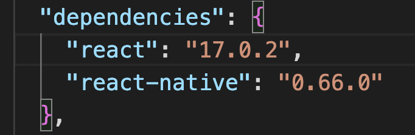

> xcode version: 13.0
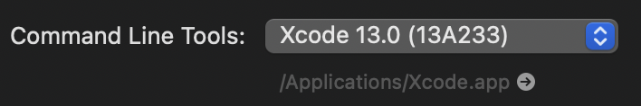

> Android studio version: Android Studio Arctic Fox | 2020.3.1 Patch 1
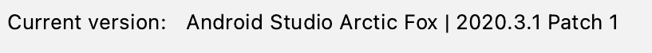

Now Open your terminal and install brew natively

**1- Install latest version of brew**

    /bin/bash -c "$(curl -fsSL https://raw.githubusercontent.com/Homebrew/install/HEAD/install.sh)"

or install it from their **[official website](https://brew.sh/)**

My brew version
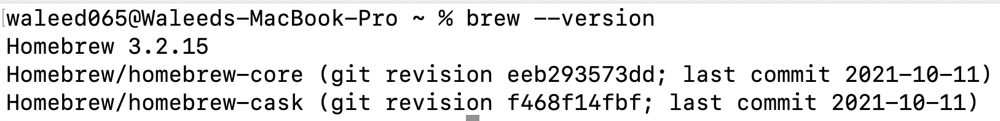

**2- Install and update Ruby to lastest version**

    brew install ruby

My ruby version
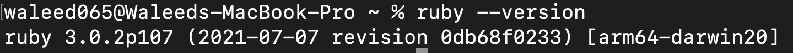

**3- Install cocoapods using gem**

    sudo gem install cocoapods

My pod version
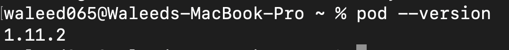

**4- Install ffi using gem**

    sudo gem install ffi

**5- Install watchman**

    brew install watchman

My watchman version
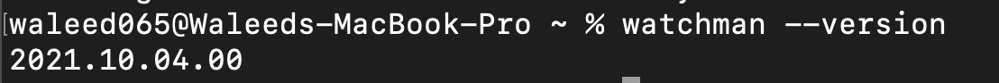

Now that the basic tools are all setup, lets now do some tweeking to make react native compatable with m1 chip.

Open **Android studio**, then go to preferences/apprearance & Behavior/System Settings/Android SDK

> Under **SDK Platforms** make sure you have latest android-sdk installed aswell as android-sdk 10.0 (Q) installed

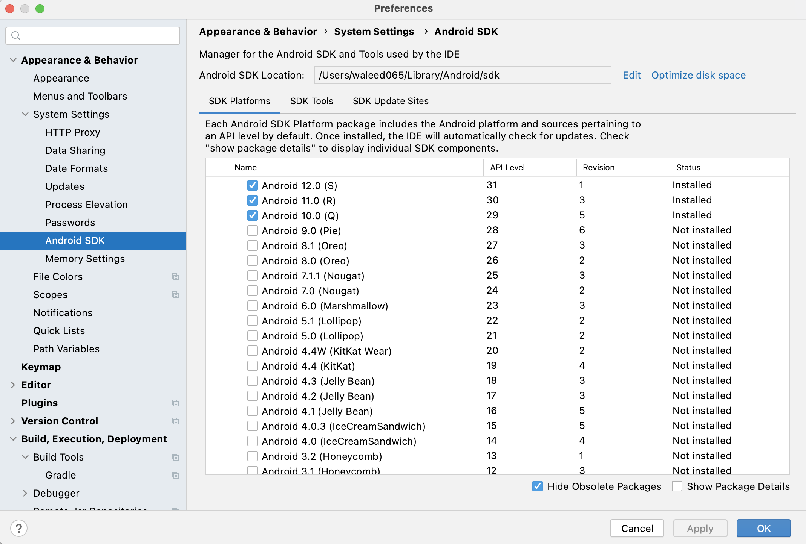

> Under **SDK Tools** make sure you have latest android build tools installed aswell as command line tools installed

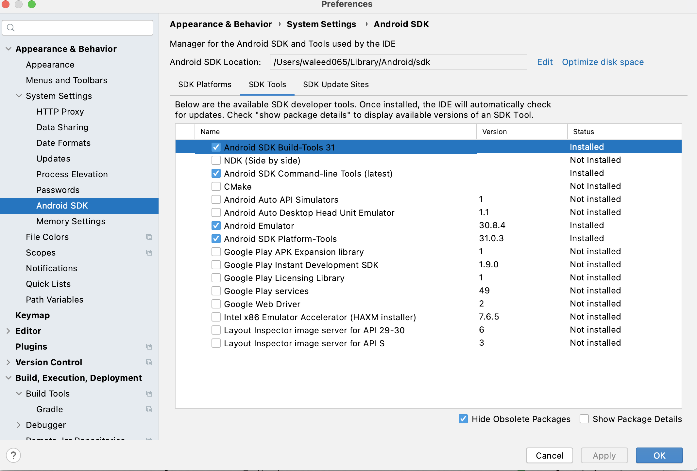

> Check mark **show package details** Under **SDK Platforms** and make sure you have latest android build tools, command line tools installed as well as arm based images of the selected tools installed

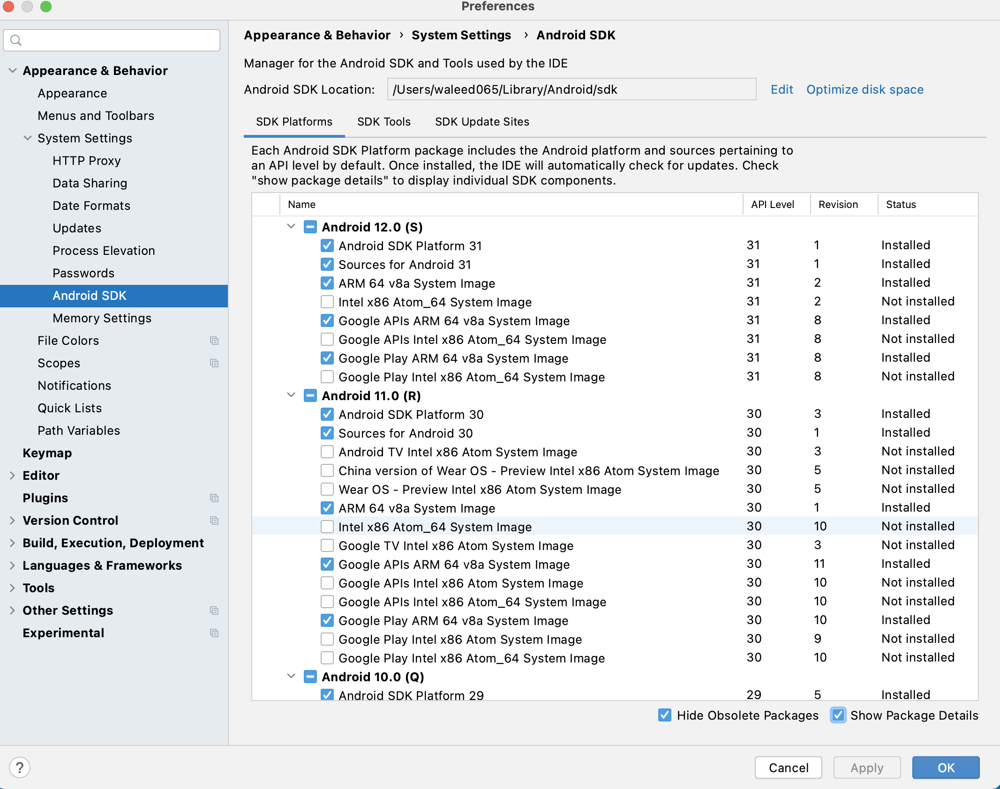

> Check mark **show package details** Under **SDK Tools** and make sure you have latest android build tools installed

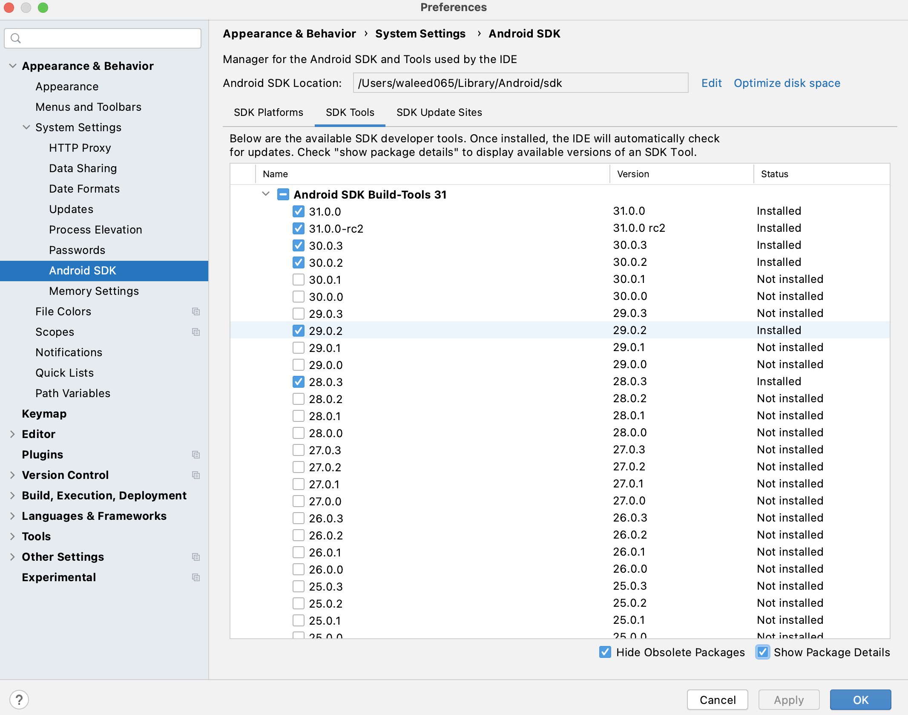

> Now go to updates section and make sure you have no updates remaining. 

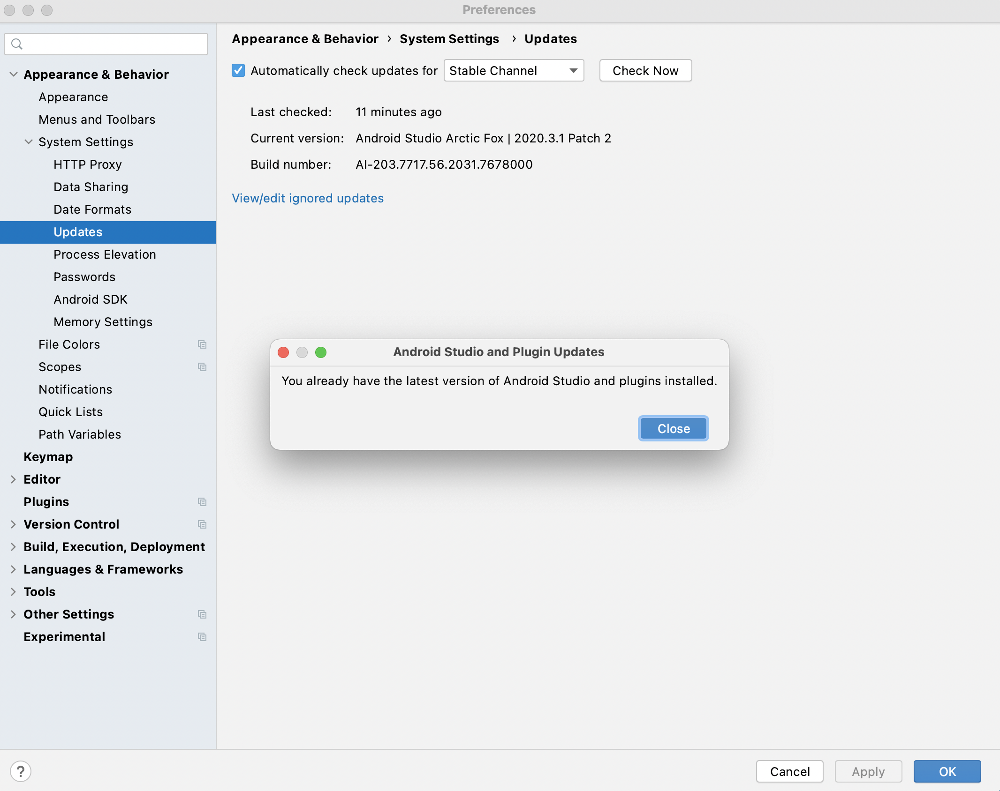

If you have updates to install then install them. If for some reason you get update error or compatability issue while updating. Then go to [official website](https://developer.android.com/studio) of android studio and download the latest version from there. Unpack it and move it to applications folder to replace it with the current version of android studio. This will make sure you have no updates remaining.

🎉🥳 **Congradulations. Part One Done ✅.** if you have successfully come this far then you're almost done. The above steps are to be only produced once and you won't need to apply these steps for future build of react native in your machine 🎉🥳

-------------------------------><-------------------------------------

## Part Two (Follow every time for setup)

Initiate react native project

    npx react-native init hello --template react-native-template-typescript

Open your project in your code editor and open terminal

Run server by either

    npm run start

Or

    yarn start

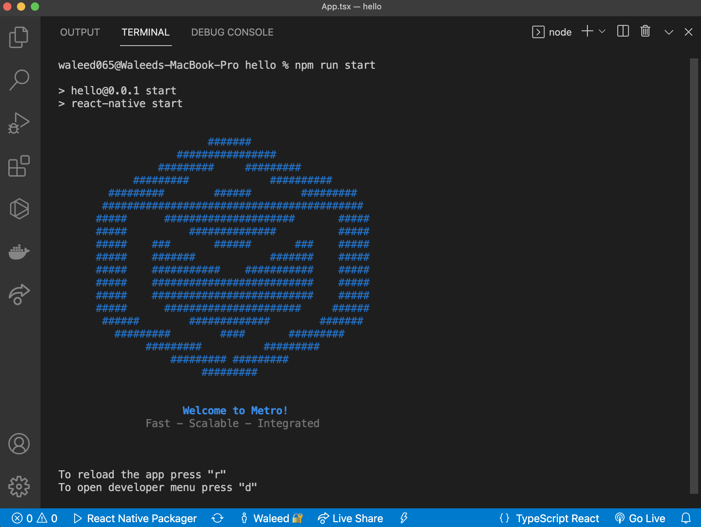

## IOS Setup

open another terminal

run

    npm run ios

Or

    yarn ios

This should pop a ios device for your and build the react native app on it succcessfully.

if for some reason you get error, then open project [projectname].xcworkspace file in ios folder using xcode. Select your ios device, then clean your project and run the application from xcode.
This should do the job.
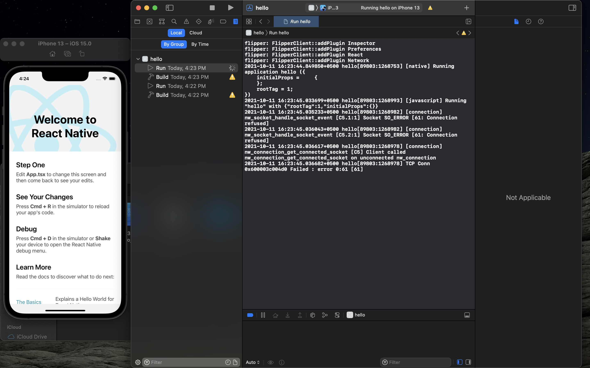

**Note**: when installing pods if `pod install` command fails then use `npx pod-install` for installing pods

## ANDROID Setup

For android we need to give path to adb once so that after that we are able to run application from terminal directly. for this open the android folder of the project using **Android Studio**.

**Go to** `preferences/Build, Execution, Deployment/Build Tools/Gradle`

Select **android sdk 11** for use. If its not installed then install it.
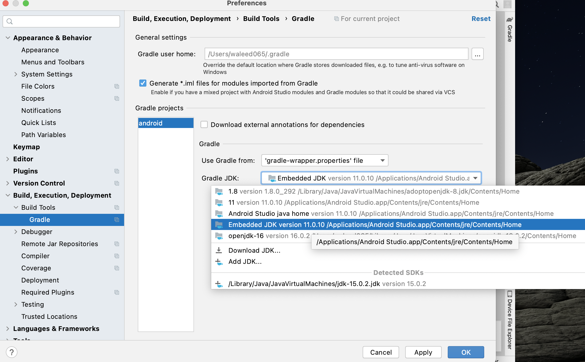

Then if android studio shows notification that says **Android Gradle Plugin can be upgraded**? You should upgrade it.

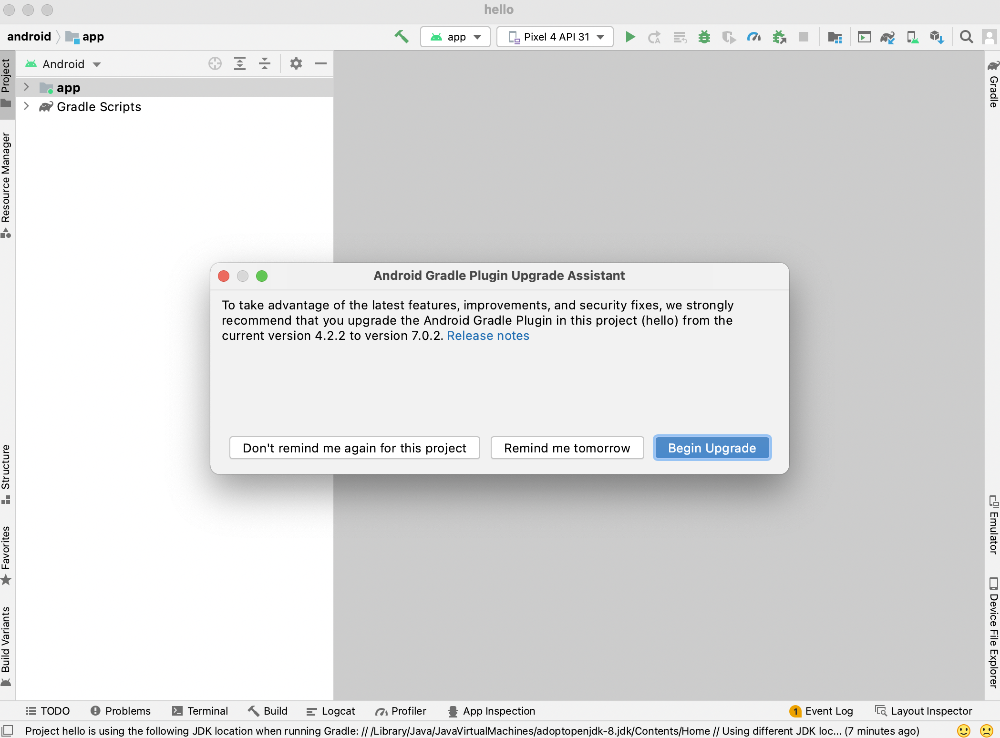

After when upgradation is done, run project form the android studio to give adb a path to the project. This steps is needed only once.
This would probably show an error in the emulator which is good and the expected outcome.
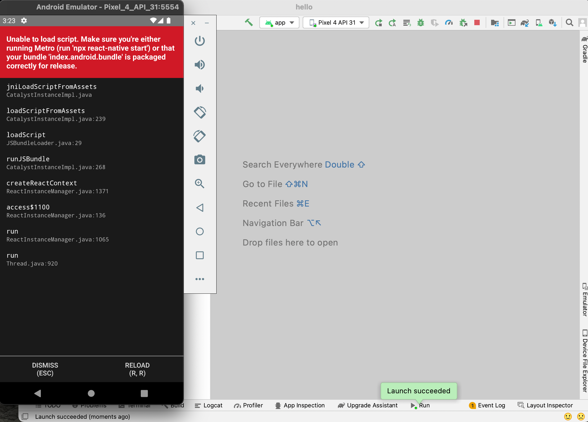

Now close the android studio but keep the emulator running.
Open the project using terminal and 

run

    npm run android

Or

    yarn android

This will build the android part of your react native application successfully.

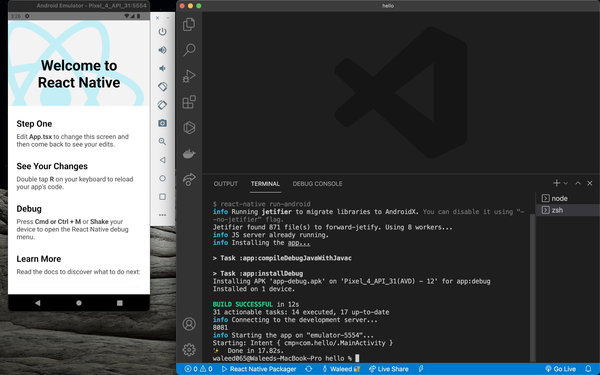

🎉 **Thats all** 🎉

### some key notes

- First part of the documentation needs to be followed only once

- Second part of the documentation needs to be followed every time you initiate a new project.

- you need to only build project to give adb a path through android studio once

- you just need to open **android emulator** manullay if not already opened to run `npx react-native run-android` command successfully.

## Credits

© [Waleed Tariq](https://github.com/Waleed065)
